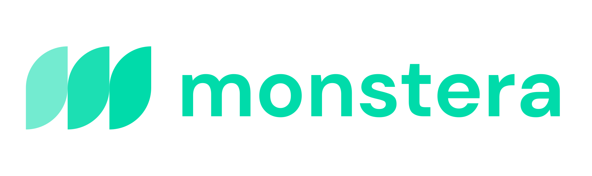

# Monstera UI
Monstera UI is a Vue 3 components library designed and developed based on the Monstera Design principles.

## Usage

| Currently, the monstera ui library only supports Vue 3   

Start by installing the monstera-vue library from npm:
```sh
npm install @flora-so/monstera-vue
```

You may now use each component as such:
```vue
<script lang="ts" setup>
import { BigButton } from "@flora-so/monstera-vue"
</script>

<tempalte>
  <bit-button label="Hello"></bit-button>
  ...
</tempalte>
```

## License
This library is MIT licensed.